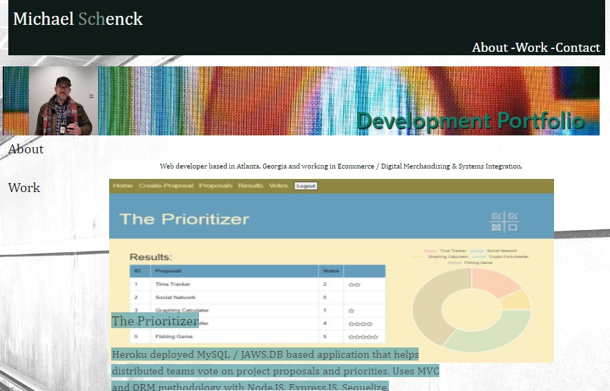
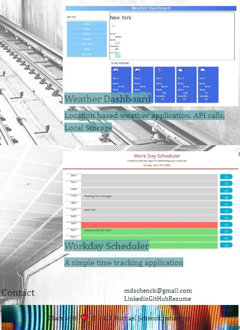
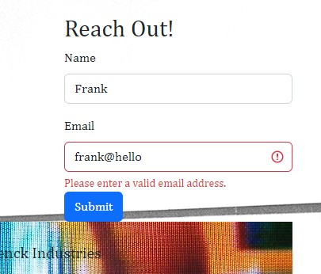

# React-Developer-Profile
Michael Schenck Developer Profile - Created With React

# Description

Developer profile created with React

## Table of Contents

- [Links](#links)
- [Screenshots](#screenshots)
- [User Story](#user-story)
- [Acceptance Criteria](#acceptance-criteria)
- [License](#license)

# Links

[GitHub Repository](https://github.com/mdschenck/React-Developer-Profile)

[Deployed Application](https://mdschenck.github.io/React-Developer-Profile)

# Screenshots
Screenshot of React Developer Profile Desktop View:

Screenshot  of React Developer Profile Mobile View:

Screenshot  of React Developer Profile Form Validation:

# User Story

- AS AN employer looking for candidates with experience building single-page applications
- I WANT to view a potential employee's deployed React portfolio of work samples
- SO THAT I can assess whether they're a good candidate for an open position

# Acceptance Criteria

The following acceptance criteria were met for the project:

GIVEN a single-page application portfolio for a web developer
- [x] WHEN I load the portfolio
THEN I am presented with a page containing a header, a section for content, and a footer
- [x] WHEN I view the header
THEN I am presented with the developer's name and navigation with titles corresponding to different sections of the portfolio
- [x] WHEN I view the navigation titles
THEN I am presented with the titles About Me, Portfolio, Contact, and Resume, and the title corresponding to the current section is highlighted
- [x] WHEN I click on a navigation title
THEN I am presented with the corresponding section below the navigation without the page reloading and that title is highlighted
- [x] WHEN I am presented with the About Me section
THEN I see a recent photo or avatar of the developer and a short bio about them
- [x] WHEN I am presented with the Portfolio section
THEN I see titled images of six of the developer’s applications with links to both the deployed applications and the corresponding GitHub repositories
- [x] WHEN I am presented with the Contact section
THEN I see a contact form with fields for a name, an email address, and a message
- [x] WHEN I move my cursor out of one of the form fields without entering text
THEN I receive a notification that this field is required
- [x] WHEN I enter text into the email address field
THEN I receive a notification if I have entered an invalid email address
- [x] WHEN I am presented with the Resume section
THEN I see a link to a downloadable resume and a list of the developer’s proficiencies
- [x] WHEN I view the footer
THEN I am presented with text or icon links to the developer’s GitHub and LinkedIn profiles, and their profile on a third platform (Stack Overflow, Twitter)

# License

MIT License https://opensource.org/licenses/MIT
